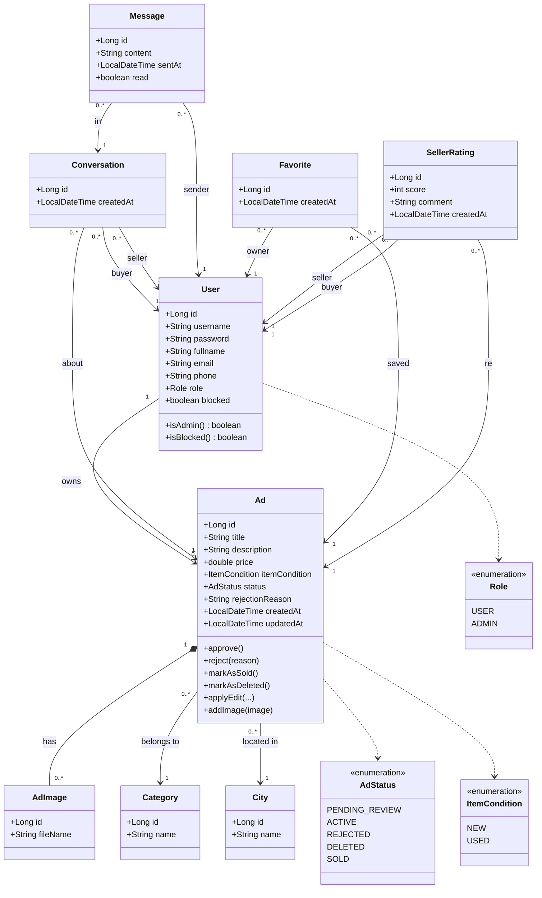

# Divar-like Marketplace

A full-stack, secondhand classifieds marketplace inspired by Divar/Sheypoor, built as the final project for the Advanced Programming course at Amirkabir University of Technology (AUT).

The system lets users register, post ads with images, browse/search/filter listings, favorite ads, message sellers, and rate sellers after a transaction, with an admin panel to moderate ads and manage users, categories, and cities.

**Team**
- Behrad Mirzapour
- Alireza Bolhasani

**Stack**
- Backend: Java 17, Spring Boot 3.3.1 (Web, Data JPA, Security, Validation), SQLite, JWT (jjwt 0.12.5)
- Frontend: Java 21, JavaFX 21 (FXML), Gson, Ikonli (FontAwesome icons)
- Build: Maven, multi-module (`backend`, `frontend`)

---

## Project structure

```
Ap-Final-Project/
├── backend/     Spring Boot REST API
├── frontend/    JavaFX desktop client
└── pom.xml      Parent/aggregator Maven module
```

---

## Backend: prerequisites & how to run

**Prerequisites**
- JDK 17+
- Maven 3.8+ (or use the Maven wrapper if present)
- No external database server needed. The backend uses an embedded SQLite file

**Steps**
1. Provide a JWT signing secret. The backend won't start without one. Copy the template and fill in a random value:
   ```bash
   cp backend/src/main/resources/application-local.properties.example backend/src/main/resources/application-local.properties
   ```
   then edit `jwt.secret` in that new file (any long random string works; `python3 -c "import secrets; print(secrets.token_urlsafe(48))"` generates one). This file is gitignored, so it stays local to your machine, never commit a real secret to `application.properties`. Alternatively, skip the file and set a `JWT_SECRET` environment variable instead, used automatically in CI/deployment.

2. From the repository root, build and run the backend module:
   ```bash
   cd backend
   mvn spring-boot:run
   ```
   or build a jar and run it directly:
   ```bash
   mvn -pl backend -am clean package
   java -jar backend/target/backend-1.0-SNAPSHOT.jar
   ```
3. On first launch, Hibernate creates the schema automatically (`spring.jpa.hibernate.ddl-auto=update`) inside a local `divar.db` SQLite file in the backend's working directory. No manual DB setup is required.
4. The API starts on the default Spring Boot port (`http://localhost:8080`).
5. On every startup, `DataSeeder` seeds a baseline set of categories and cities if the tables are empty, so the app is usable immediately on a fresh database.

## Frontend: how to run

**Prerequisites**
- JDK 21+
- Maven 3.8+
- The backend must already be running, since the JavaFX client talks to it over HTTP

**Steps**
1. From the repository root:
   ```bash
   cd frontend
   mvn javafx:run
   ```
2. This launches the desktop client (`divar.aut.frontend.Launcher`). Log in or register from the welcome screen. The client points at the backend's base URL configured in `ApiConfig`.

Both modules can also be opened together as a multi-module Maven project in IntelliJ IDEA using the root `pom.xml`.

---

## Data storage & test accounts

All data is persisted in a single embedded **SQLite** database file (`divar.db`), accessed through Spring Data JPA/Hibernate. Every domain entity, including users, ads, ad images, categories, cities, conversations, messages, favorites, and seller ratings, is mapped to its own table, and the schema is created/updated automatically at startup. Because the database is a local file rather than an in-memory store, all data survives an application restart.

There are no pre-seeded user or admin accounts. To try the app:
1. Register a regular account from the frontend's sign-up screen.
2. To test admin-only features (ad moderation, category/city management, user blocking, statistics dashboard), promote a registered user to `ADMIN` by setting their `role` column to `ADMIN` directly in `divar.db` (e.g. with the `sqlite3` CLI or a SQLite browser), then log back in.

---

## Domain model (UML class diagram)



`Ad` is the core entity: every ad starts as `PENDING_REVIEW`, and only an admin approval moves it to `ACTIVE` (publicly visible), with `REJECTED`, `SOLD`, and `DELETED` as the other lifecycle states. `Conversation` ties a buyer and seller together around one ad and owns a thread of `Message`s; `Favorite` and `SellerRating` are join entities connecting users to ads.

---

## Implemented features

### Authentication & authorization
- Registration and login with full name, email, and phone format validation
- JWT-based authentication, with the token carrying the authenticated user's identity and role
- Role-based access control (`USER` / `ADMIN`) enforced on the backend for every protected endpoint
- Blocked users are rejected at login, and also re-checked on every request in case they were blocked after their token was issued


### Ads
- Create, view, edit, and delete ads (owner-only for edit/delete)
- Multi-image upload per ad with a gallery display
- Category and city selection
- Search and filter, with sorting by price, date, or seller rating
- Ad lifecycle: `PENDING_REVIEW → ACTIVE/REJECTED`, `ACTIVE → SOLD`, and soft deletion


### Favorites
- Save/unsave ads to a personal favorites list, with duplicate favorites prevented


### Chat & messaging
- Per-ad conversation threads between buyer and seller
- Read/unread tracking per message, with unread-count badges on conversation cards and the main navigation
- Blocked users cannot start or continue conversations


### Seller ratings
- Buyers can rate a seller once per seller (1–5 score plus an optional comment)
- Ratings from blocked users are hidden


### Admin panel
- Approve/reject pending ads, with an optional rejection reason shown to the seller
- Manage categories and cities
- Block/unblock users
- Delete individual seller-rating comments
- Statistics dashboard (users, ads, pending ads, etc.)


### UI/UX
- Full light/dark theme system with a live toggle, applied consistently across every screen and dialog
- RTL layout fixes for Persian text throughout the app
- FontAwesome icons (via Ikonli) in place of emoji, to avoid rendering issues on Linux/WSL


---

## Team contributions

**Behrad Mirzapour** focused heavily on  UI development and implementing key backend sections: building and wiring the JavaFX screens for authentication, ad browsing/search/filtering, the post-ad form, favorites, and the chat/conversation UI. He implemented the full light/dark theme system (`ThemeManager`, per-screen stylesheets, and toggle wiring across the welcome screen, main navigation, and admin header). On the backend, he built out the Ad CRUD API and service layer, search/filter and multi-image upload support, JWT security and structured API error handling, the favorites and conversation/messaging APIs, the admin ad-moderation and statistics endpoints, seller-rating APIs, and category/city management, along with the initial JavaFX project setup, package reorganization, and read/unread message tracking. He also authored the final registration validation for full name, email, and phone format, and hardened JWT secret configuration. He also wrote this README.

**Alireza Bolhasani** drove the initial project setup and backend foundation: configuring the multi-module Maven build, setting up the `User` entity with SQLite persistence, and implementing the JWT authentication flow for login/register on both backend and frontend. He built the ad-posting and ad-image-upload features (including secure image storage) and the admin ad-approval workflow with role-based access control. On the frontend, he designed the original MainView with a glassmorphism dark theme, the ad card component, and the ad image gallery. He also wrote the seller-rating restriction logic (one rating per buyer/seller pair), the blocked-user messaging restrictions, message timestamps and date separators, and a substantial JUnit test suite covering authentication, ads, chat, seller ratings, and admin operations, in addition to writing JavaDoc across the entity, controller, DTO, and utility classes.

Both members contributed commits visible in the project's git history throughout development.
