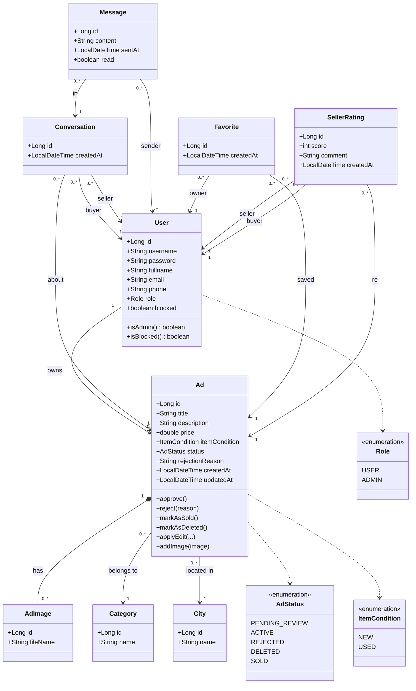
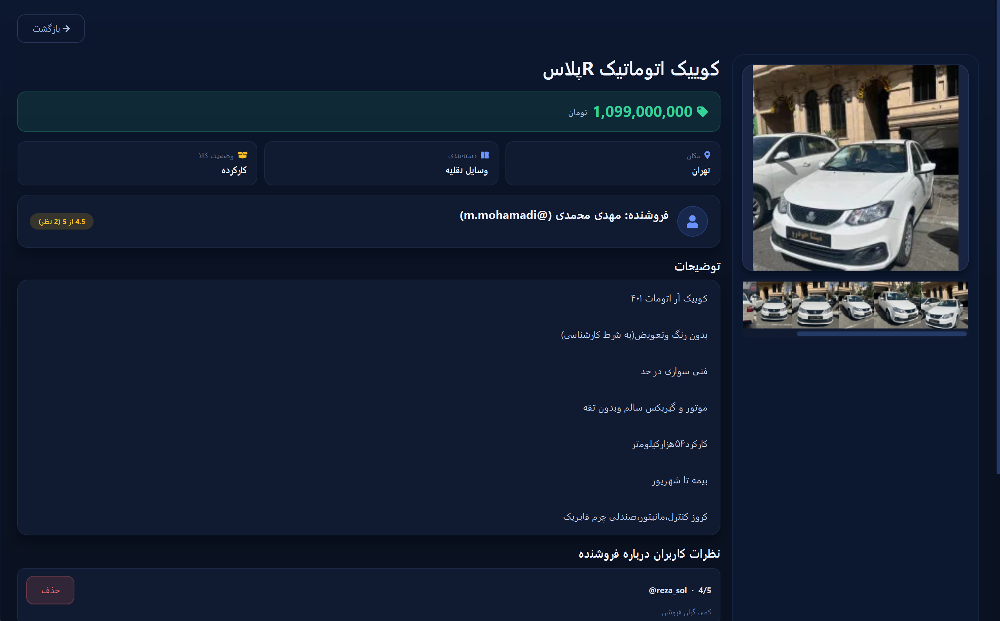
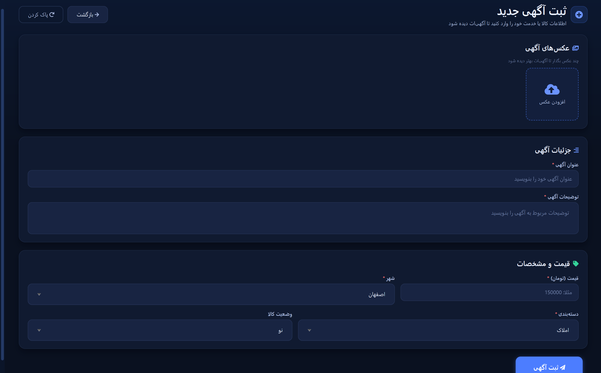
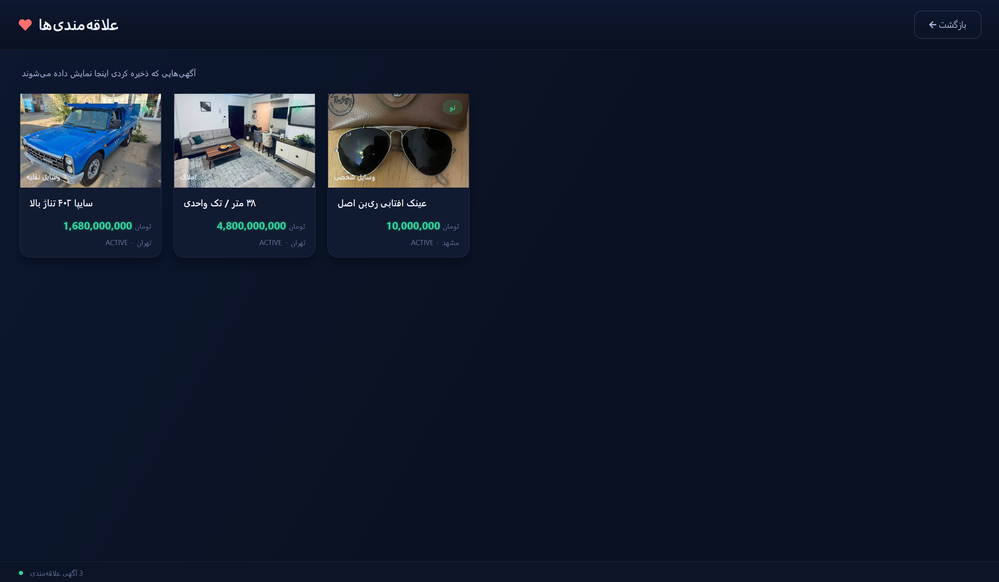
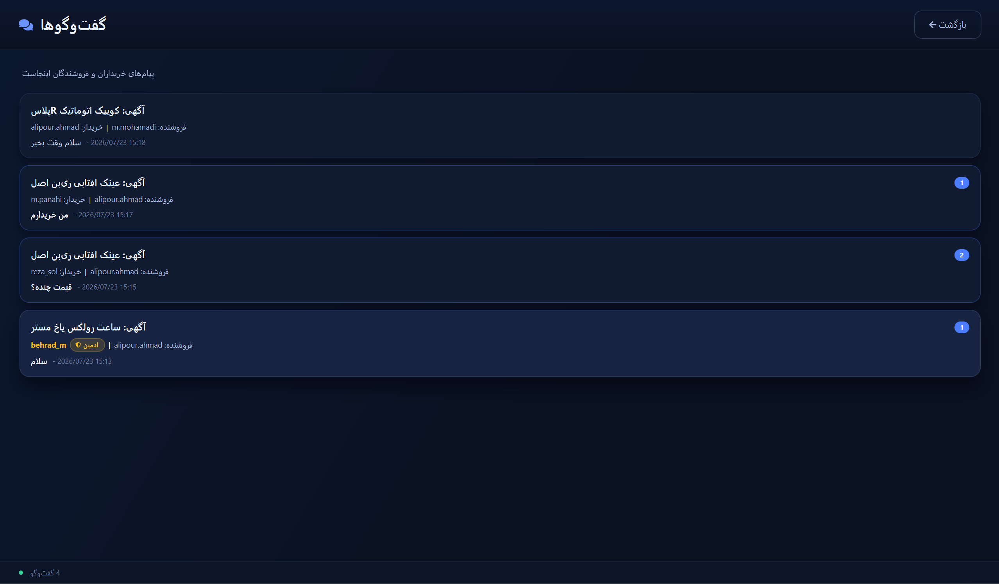
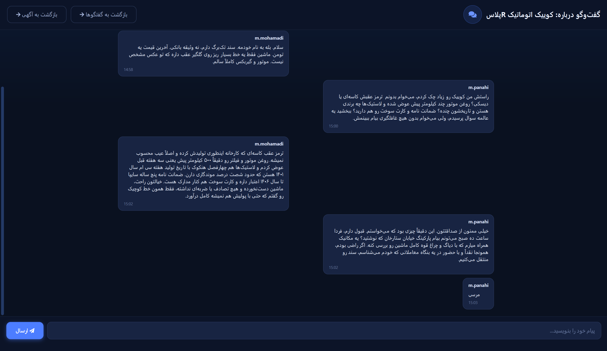
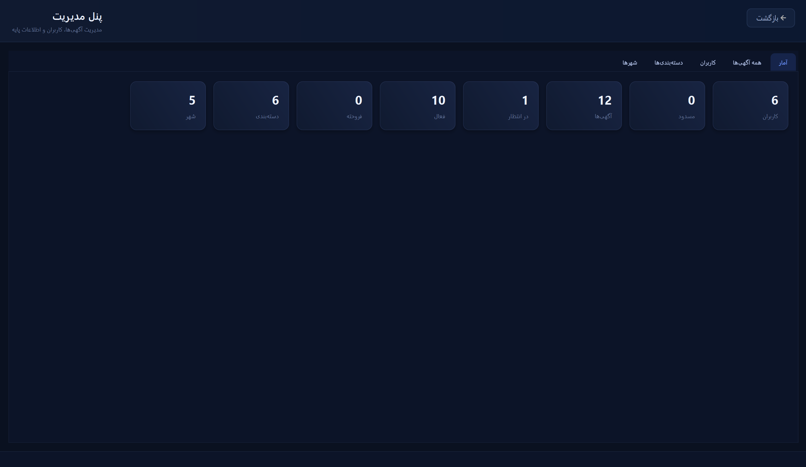
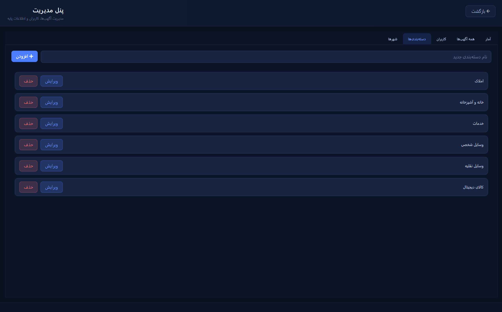
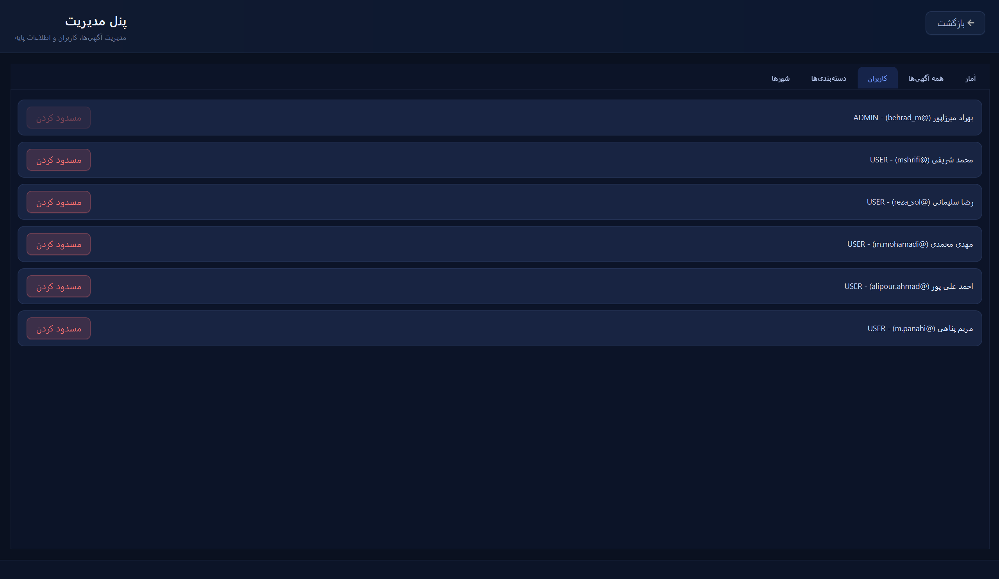
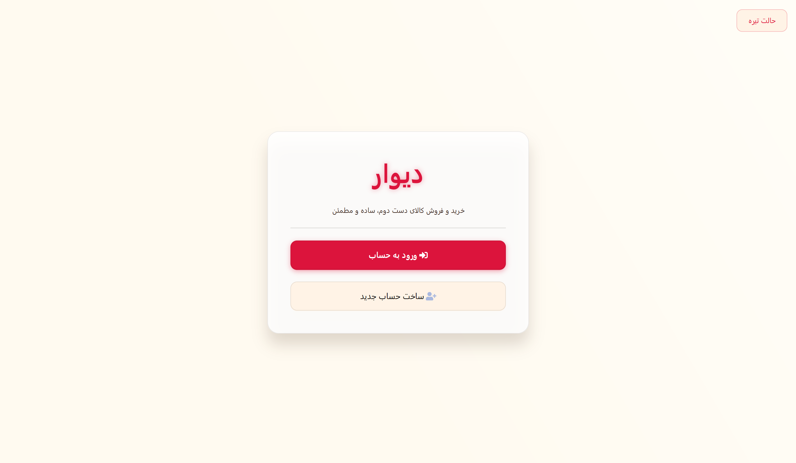

<div dir="rtl">

# بازارچه‌ی آگهی مشابه دیوار

یک بازارچه‌ی آگهی‌های دست‌دوم، full-stack، الهام‌گرفته از دیوار/شیپور، که به‌عنوان پروژه‌ی پایانی درس برنامه‌نویسی پیشرفته در دانشگاه صنعتی امیرکبیر (AUT) ساخته شده است.

این سیستم به کاربران امکان می‌دهد ثبت‌نام کنند، آگهی همراه با عکس ثبت کنند، آگهی‌ها را مرور/جست‌وجو/فیلتر کنند، آگهی‌ها را به علاقه‌مندی‌ها اضافه کنند، با فروشندگان پیام‌رسانی کنند و پس از انجام معامله به فروشنده امتیاز بدهند؛ همچنین یک پنل مدیریت برای تأیید/رد آگهی‌ها و مدیریت کاربران، دسته‌بندی‌ها و شهرها در اختیار دارد.

**تیم**
- بهراد میرزاپور
- علیرضا بوالحسنی

**پشته‌ی فناوری**
- بک‌اند: جاوا ۱۷، اسپرینگ بوت ۳.۳.۱ (Web، Data JPA، Security، Validation)، اس‌کیوال‌لایت (SQLite)، JWT (نسخه‌ی jjwt 0.12.5)
- فرانت‌اند: جاوا ۲۱، جاوافایکس ۲۱ (FXML)، Gson، Ikonli (آیکون‌های FontAwesome)
- ابزار ساخت: Maven، به‌صورت چندماژولی (`backend`، `frontend`)

---

## ساختار پروژه

```
Ap-Final-Project/
├── backend/     رابط برنامه‌نویسی REST مبتنی بر اسپرینگ بوت
├── frontend/    کلاینت دسکتاپ جاوافایکس
└── pom.xml      ماژول اصلی/تجمیع‌کننده‌ی Maven
```

---

## بک‌اند: پیش‌نیازها و نحوه‌ی اجرا

**پیش‌نیازها**
- JDK نسخه‌ی ۱۷ یا بالاتر
- Maven نسخه‌ی ۳.۸ یا بالاتر (یا استفاده از Maven wrapper در صورت وجود)
- نیازی به سرور پایگاه‌داده‌ی خارجی نیست؛ بک‌اند از یک فایل SQLite جاسازی‌شده استفاده می‌کند

**مراحل**
۱. یک کلید (secret) امضای JWT فراهم کنید. بدون آن بک‌اند اجرا نمی‌شود. قالب را کپی کرده و مقداری تصادفی در آن قرار دهید:
   ```bash
   cp backend/src/main/resources/application-local.properties.example backend/src/main/resources/application-local.properties
   ```
   سپس مقدار `jwt.secret` را در این فایل جدید ویرایش کنید (هر رشته‌ی تصادفی طولانی کافی است؛ دستور `python3 -c "import secrets; print(secrets.token_urlsafe(48))"` یکی برای شما تولید می‌کند). این فایل در gitignore قرار دارد، بنابراین فقط روی سیستم شما باقی می‌ماند؛ هرگز یک کلید واقعی را در `application.properties` کامیت نکنید. به‌جای این فایل می‌توانید به‌جایش متغیر محیطی `JWT_SECRET` را تنظیم کنید که در محیط CI/استقرار به‌طور خودکار استفاده می‌شود.

۲. از ریشه‌ی مخزن، ماژول بک‌اند را بیلد و اجرا کنید:
   ```bash
   cd backend
   mvn spring-boot:run
   ```
   یا یک jar بسازید و مستقیم اجرایش کنید:
   ```bash
   mvn -pl backend -am clean package
   java -jar backend/target/backend-1.0-SNAPSHOT.jar
   ```
۳. در اولین اجرا، Hibernate به‌طور خودکار اسکیمای پایگاه‌داده را می‌سازد (`spring.jpa.hibernate.ddl-auto=update`) و آن را درون یک فایل SQLite محلی به نام `divar.db` در دایرکتوری کاری بک‌اند قرار می‌دهد. نیازی به راه‌اندازی دستی پایگاه‌داده نیست.
۴. رابط برنامه‌نویسی روی پورت پیش‌فرض اسپرینگ بوت بالا می‌آید (`http://localhost:8080`).
۵. در هر بار اجرا، کلاس `DataSeeder` در صورت خالی بودن جدول‌ها، مجموعه‌ای پایه از دسته‌بندی‌ها و شهرها را وارد می‌کند تا برنامه بلافاصله روی یک پایگاه‌داده‌ی تازه قابل استفاده باشد.

## فرانت‌اند: نحوه‌ی اجرا

**پیش‌نیازها**
- JDK نسخه‌ی ۲۱ یا بالاتر
- Maven نسخه‌ی ۳.۸ یا بالاتر
- بک‌اند باید از قبل در حال اجرا باشد، چون کلاینت جاوافایکس از طریق HTTP با آن ارتباط برقرار می‌کند

**مراحل**
۱. از ریشه‌ی مخزن:
   ```bash
   cd frontend
   mvn javafx:run
   ```
۲. با این کار کلاینت دسکتاپ اجرا می‌شود (`divar.aut.frontend.Launcher`). از صفحه‌ی خوش‌آمدگویی وارد شوید یا ثبت‌نام کنید. آدرس پایه‌ی بک‌اند در کلاینت از طریق `ApiConfig` تنظیم می‌شود.

هر دو ماژول را می‌توان با استفاده از فایل `pom.xml` ریشه، به‌صورت یک پروژه‌ی Maven چندماژولی در IntelliJ IDEA با هم باز کرد.

---

## ذخیره‌سازی داده و حساب‌های آزمایشی

تمام داده‌ها در یک فایل پایگاه‌داده‌ی **SQLite** جاسازی‌شده (`divar.db`) و از طریق Spring Data JPA/Hibernate نگهداری می‌شوند. هر موجودیت دامنه، از جمله کاربران، آگهی‌ها، تصاویر آگهی، دسته‌بندی‌ها، شهرها، مکالمات، پیام‌ها، علاقه‌مندی‌ها و امتیازهای فروشنده، به جدول اختصاصی خودش نگاشت می‌شود و اسکیما در زمان اجرا به‌طور خودکار ساخته/به‌روزرسانی می‌شود. از آنجا که پایگاه‌داده یک فایل محلی است، نه یک انبار داده‌ی درون‌حافظه‌ای، تمام داده‌ها پس از ری‌استارت برنامه باقی می‌مانند.

هیچ حساب کاربری یا مدیریتی از پیش ثبت‌نشده وجود ندارد. برای امتحان برنامه:
۱. از صفحه‌ی ثبت‌نام فرانت‌اند یک حساب کاربری معمولی بسازید.
۲. برای آزمایش قابلیت‌های ویژه‌ی مدیر (تأیید آگهی، مدیریت دسته‌بندی/شهر، مسدودسازی کاربر، داشبورد آماری)، یک کاربر ثبت‌شده را با تنظیم مستقیم ستون `role` به مقدار `ADMIN` در فایل `divar.db` (مثلاً با ابزار خط‌فرمان `sqlite3` یا یک مرورگر SQLite) ارتقا دهید، سپس دوباره وارد شوید.

---

## مدل دامنه (نمودار کلاس UML)



`Ad` موجودیت اصلی سیستم است: هر آگهی با وضعیت `PENDING_REVIEW` (در انتظار بررسی) شروع می‌شود و فقط با تأیید مدیر به `ACTIVE` (منتشرشده و عمومی) تغییر وضعیت می‌دهد؛ `REJECTED`، `SOLD` و `DELETED` وضعیت‌های دیگر چرخه‌ی عمر آگهی هستند. `Conversation` خریدار و فروشنده را حول یک آگهی به هم متصل می‌کند و یک رشته از `Message`ها را نگه می‌دارد؛ `Favorite` و `SellerRating` موجودیت‌های واسطی هستند که کاربران را به آگهی‌ها مرتبط می‌کنند.

---

## قابلیت‌های پیاده‌سازی‌شده

### احراز هویت و مجوزدهی
- ثبت‌نام و ورود همراه با اعتبارسنجی فرمت نام کامل، ایمیل و شماره تلفن
- احراز هویت مبتنی بر JWT، که توکن آن هویت و نقش کاربر احرازهویت‌شده را حمل می‌کند
- کنترل دسترسی مبتنی بر نقش (`USER` / `ADMIN`) که در بک‌اند برای هر endpoint محافظت‌شده اعمال می‌شود
- کاربران مسدودشده در زمان ورود رد می‌شوند و در هر درخواست نیز دوباره بررسی می‌شوند، برای مواردی که کاربر پس از صدور توکن مسدود شده باشد


### آگهی‌ها
- ایجاد، مشاهده، ویرایش و حذف آگهی (ویرایش/حذف فقط برای مالک آگهی)
- بارگذاری چند تصویر برای هر آگهی همراه با نمایش گالری
- انتخاب دسته‌بندی و شهر
- جست‌وجو و فیلتر، همراه با مرتب‌سازی بر اساس قیمت، تاریخ یا امتیاز فروشنده
- چرخه‌ی عمر آگهی: `PENDING_REVIEW → ACTIVE/REJECTED`، `ACTIVE → SOLD`، و حذف نرم (soft delete)





### علاقه‌مندی‌ها
- افزودن/حذف آگهی از لیست علاقه‌مندی‌های شخصی، با جلوگیری از ثبت تکراری



### گفتگو و پیام‌رسانی
- رشته‌های مکالمه‌ی مجزا برای هر آگهی، بین خریدار و فروشنده
- ردیابی خوانده‌شده/نخوانده برای هر پیام، همراه با نشان تعداد پیام‌های نخوانده روی کارت مکالمه و منوی اصلی
- کاربران مسدودشده نمی‌توانند مکالمه‌ای شروع کنند یا ادامه دهند




### امتیازدهی به فروشنده
- خریداران می‌توانند به هر فروشنده فقط یک‌بار امتیاز بدهند (نمره‌ی ۱ تا ۵ به‌همراه یک نظر اختیاری)
- امتیازهای ثبت‌شده توسط کاربران مسدودشده پنهان می‌شوند


### پنل مدیریت
- تأیید/رد آگهی‌های در انتظار بررسی، همراه با دلیل رد (اختیاری) که به فروشنده نمایش داده می‌شود
- مدیریت دسته‌بندی‌ها و شهرها
- مسدودسازی/رفع مسدودی کاربران
- حذف تکی نظرهای امتیازدهی فروشنده
- داشبورد آماری (تعداد کاربران، آگهی‌ها، آگهی‌های در انتظار و غیره)






### رابط کاربری/تجربه‌ی کاربری
- سیستم کامل تم روشن/تاریک همراه با کلید تغییر آنی، به‌طور یکپارچه در تمام صفحات و دیالوگ‌ها اعمال‌شده
- اصلاح چیدمان راست‌به‌چپ (RTL) برای متن فارسی در سراسر برنامه
- آیکون‌های FontAwesome (از طریق Ikonli) به‌جای ایموجی، برای جلوگیری از مشکلات نمایش در لینوکس/WSL




---

## سهم اعضای تیم

**بهراد میرزاپور** تمرکز اصلی‌اش روی وسعه رابط کاربری (UI) و پیاده‌سازی بخش‌های کلیدی بک‌اند بود، از آن جمله ساخت و اتصال صفحات جاوافایکس برای احراز هویت، مرور/جست‌وجو/فیلتر آگهی، فرم ثبت آگهی، علاقه‌مندی‌ها، و رابط گفتگو/مکالمه. او سیستم کامل تم روشن/تاریک (`ThemeManager`، استایل‌شیت مخصوص هر صفحه، و اتصال کلید تغییر تم در صفحه‌ی خوش‌آمدگویی، ناوبری اصلی و هدر مدیریت) را پیاده‌سازی کرد. در بخش بک‌اند، او رابط برنامه‌نویسی CRUD آگهی و لایه‌ی سرویس آن، پشتیبانی از جست‌وجو/فیلتر و بارگذاری چند تصویر، امنیت JWT و مدیریت ساختاریافته‌ی خطاهای API، رابط‌های برنامه‌نویسی علاقه‌مندی‌ها و مکالمه/پیام‌رسانی، endpointهای تأیید آگهی و آمار مدیریت، رابط‌های برنامه‌نویسی امتیازدهی فروشنده، و مدیریت دسته‌بندی/شهر را ساخت، به‌همراه راه‌اندازی اولیه‌ی پروژه‌ی جاوافایکس، بازسازماندهی پکیج‌ها، و ردیابی پیام‌های خوانده/نخوانده. او همچنین اعتبارسنجی نهایی ثبت‌نام برای نام کامل، ایمیل و فرمت شماره تلفن را نوشت، و پیکربندی کلید امنیتی JWT را سخت‌گیرانه‌تر کرد. او این فایل README را نیز نوشت.

**علیرضا بوالحسنی** راه‌اندازی اولیه‌ی پروژه و پایه‌ی بک‌اند را به انجام رسانید، از آن جمله پیکربندی ساخت چندماژولی Maven، تنظیم موجودیت `User` همراه با پایداری در SQLite، و پیاده‌سازی جریان احراز هویت JWT برای ورود/ثبت‌نام در هر دو بخش بک‌اند و فرانت‌اند. او قابلیت‌های ثبت آگهی و بارگذاری تصویر آگهی (شامل ذخیره‌سازی امن تصاویر) و گردش‌کار تأیید آگهی توسط مدیر همراه با کنترل دسترسی مبتنی بر نقش را ساخت. در فرانت‌اند، او نمای اصلی اولیه با تم تاریک شیشه‌ای (glassmorphism)، کامپوننت کارت آگهی، و گالری تصویر آگهی را طراحی کرد. او همچنین منطق محدودیت امتیازدهی فروشنده (یک امتیاز برای هر جفت خریدار/فروشنده)، محدودیت‌های پیام‌رسانی کاربران مسدودشده، برچسب زمانی پیام‌ها و جداکننده‌های تاریخ، و مجموعه‌ی قابل‌توجهی از تست‌های JUnit پوشش‌دهنده‌ی احراز هویت، آگهی‌ها، گفتگو، امتیازدهی فروشنده و عملیات مدیریتی را نوشت، به‌علاوه‌ی نگارش JavaDoc در سراسر کلاس‌های موجودیت، کنترلر، DTO و ابزار کمکی.

هر دو عضو در طول توسعه، کامیت‌های قابل‌مشاهده در تاریخچه‌ی گیت پروژه داشته‌اند.

